<div align="center">

# Muhammad Zaid

### Frontend Developer



<br>

Building clean, responsive and interactive web experiences.

</div>

---

## 👨‍💻 About Me

I'm a **Frontend Developer** focused on building responsive and interactive web experiences using **HTML, CSS and JavaScript**.

I enjoy breaking problems into smaller parts, understanding how applications work, improving code quality, and turning ideas into working projects.

I'm currently strengthening my frontend development skills while preparing for the next stage of my journey toward **MERN Stack Development**.

- 💻 Frontend Developer
- 🌱 Currently learning React, SEO and Deployment
- 🧠 Improving JavaScript patterns, logic and problem solving
- 🛠️ Working with Git, GitHub, VS Code and Command Line
- 📱 Interested in responsive and accessible interfaces
- 🚀 Long-term goal: MERN Stack Developer
- 📍 Khairpur Mirs, Sindh, Pakistan

---

# 🧰 Tech Stack

## Frontend

<p>


</p>

## Development Tools

<p>


</p>

---

# 📊 Current Skill Assessment

> These percentages represent my current learning assessment and are not official certifications or industry rankings.

| Area | Current Level |
|---|---:|
| HTML | 75–85% |
| CSS Fundamentals | 75–85% |
| Flexbox | 80–85% |
| Responsive CSS | 70–80% |
| JavaScript ES6+ | 65–75% |
| DOM / Interaction | 65–75% |
| Clean Code | 65–70% |
| Code Readability | ~70% |
| Component Thinking | 65–70% |
| CSS Architecture | 55–65% |
| Reusability | 60–70% |
| Debugging | 60–70% |
| Production Architecture | 50–60% |
| Git / GitHub | Developing |
| Deployment | Developing |
| React / MERN | Next Major Stage |

---

# 📈 Development Progress

### HTML

```text
█████████████████░░░  75–85%