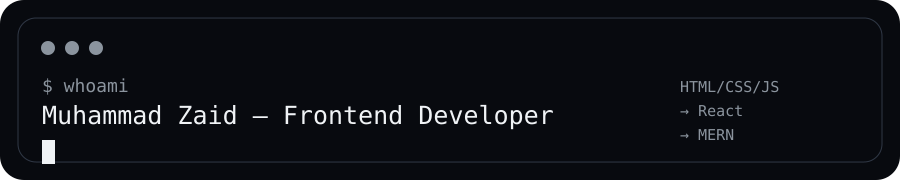
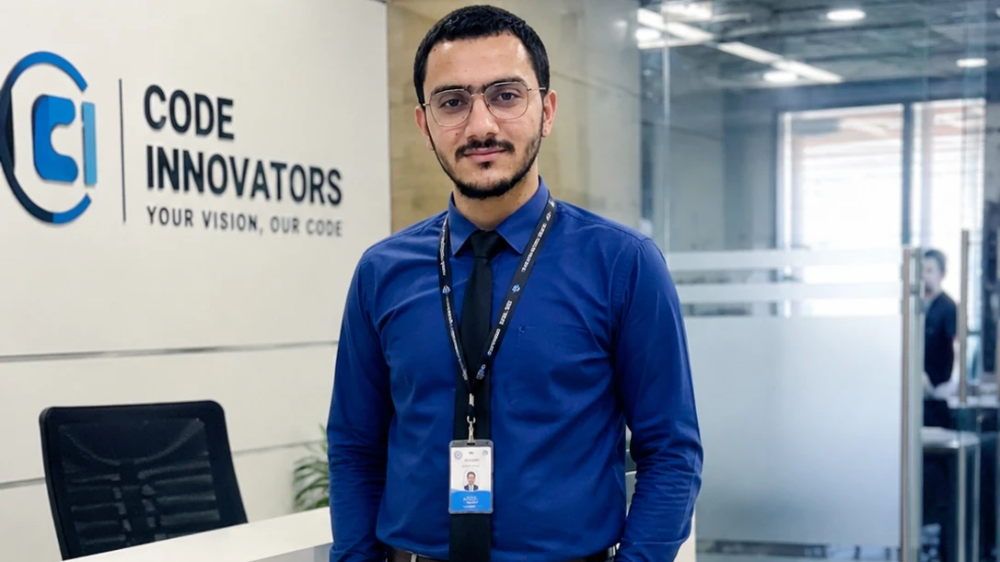
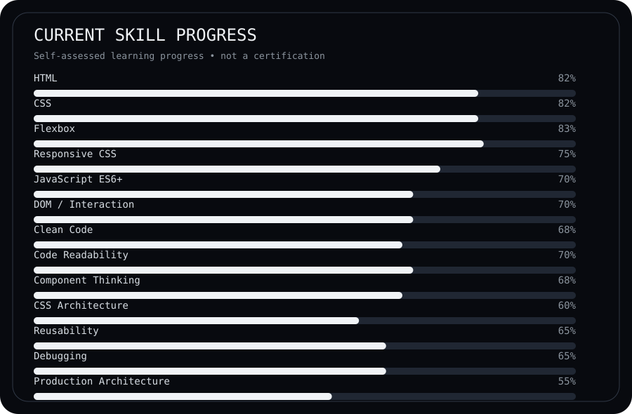
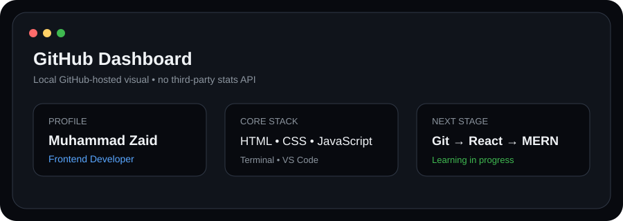
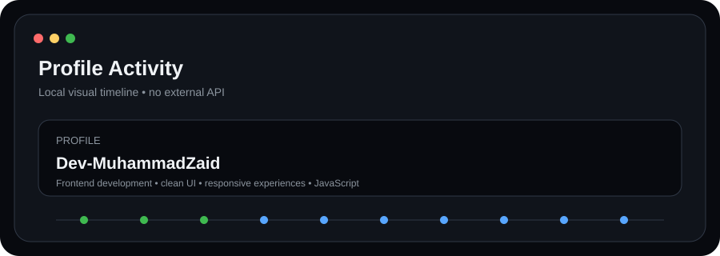
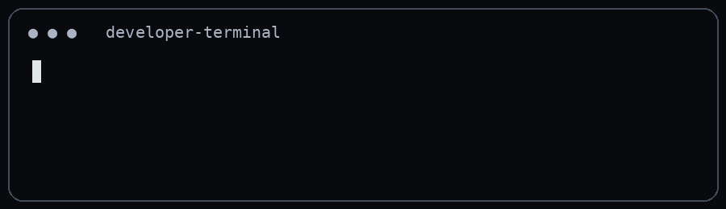

# Muhammad Zaid

### Frontend Developer

**Building clean, responsive and interactive web experiences.**



<p>
  <a href="https://github.com/Dev-MuhammadZaid">
    
  </a>
  <a href="https://linkedin.com/in/muhammadzaid-dev">
    
  </a>
  <a href="mailto:webdevmzaid8345@gmail.com">
    
  </a>
</p>


</div>

---

## 👨‍💻 About Me

I'm a **Frontend Developer** focused on building responsive, interactive and user-friendly web experiences with **HTML, CSS and JavaScript**.

I enjoy breaking problems into smaller pieces, understanding how code works, improving readability, and turning ideas into working projects.

I'm currently strengthening my JavaScript and developer workflow skills while moving toward **React and MERN Stack Development**.

- 💻 Frontend Developer
- 🌱 Learning React, Git and GitHub
- 🧠 Improving JavaScript patterns, logic and problem solving
- 🛠️ Working with VS Code and Command Line
- 📱 Interested in responsive and accessible interfaces
- 🚀 Long-term direction: MERN Stack Development
- 📍 Pakistan

---

## ⚡ Current Focus

```text
Frontend Foundations  ███████████████████░  Strong
JavaScript ES6+       ███████████████░░░░░  Developing
Git / GitHub           ████████████░░░░░░░  Developing
React                  ███████░░░░░░░░░░░░  Learning
Backend / MERN         ████░░░░░░░░░░░░░░░  Next Stage
```

---

## 🧰 Tech Stack

### Frontend

<p>
  
  
  
</p>

### Tools

<p>
  
  
  
  
</p>

### Next Major Stage

<p>
  
  
</p>

---

## 📊 Skill Progress Dashboard

> These percentages are a **self-assessed learning-progress estimate**, not certifications or industry rankings.



---

## 🧭 Learning Roadmap

```text
HTML + CSS
    │
    ▼
JavaScript ES6+
    │
    ▼
DOM + Projects + Logic
    │
    ▼
Git + GitHub
    │
    ▼
React
    │
    ▼
Node.js + Express
    │
    ▼
MongoDB
    │
    ▼
MERN Stack
```

---

<div align="center">


<a href="https://dev-muhammadzaid.github.io/portfolio-site-v2.0/">


</a>

</div>

---

## 📌 Project Philosophy

I don't want to only make projects that "work".

My goal is to gradually improve how I:

```text
Understand the requirement
        ↓
Break the problem down
        ↓
Design the UI
        ↓
Plan the logic
        ↓
Write readable code
        ↓
Debug systematically
        ↓
Refactor
        ↓
Deploy
```

---

## 📊 GitHub Dashboard

<div align="center">



</div>

---
<div align="center">



</div>

## 📅 Contribution Activity

<div align="center">


</div>

---

## 🗂️ GitHub Activity

My GitHub profile is where I track my projects, experiments, learning progress and development journey.

<a href="https://github.com/Dev-MuhammadZaid?tab=repositories">
  
</a>

---

## 🎯 Development Goals

### Short Term

- Strengthen JavaScript problem solving
- Improve Git and GitHub workflow
- Build more reusable frontend components
- Learn React properly
- Improve deployment knowledge

### Long Term

- Become a professional MERN Stack Developer
- Build production-quality applications
- Understand backend architecture
- Learn secure deployment practices
- Contribute to meaningful projects

---

## 🧠 Developer Mindset

> **Understand first. Build second. Debug systematically. Refactor continuously.**

I believe becoming a better developer is not only about learning more syntax.

It's about learning how to:

- think through problems
- recognize patterns
- understand existing code
- design maintainable solutions
- debug instead of guessing
- keep improving through real projects

---

## 🤝 Let's Connect

<div align="center">

<a href="https://github.com/Dev-MuhammadZaid">
  
</a>

<a href="https://linkedin.com/in/muhammadzaid-dev">
  
</a>

<a href="mailto:webdevmzaid8345@gmail.com">
  
</a>

</div>

---

<div align="center">

### `Building → Learning → Improving → Repeating`



⭐ Thanks for visiting my profile.

</div>
